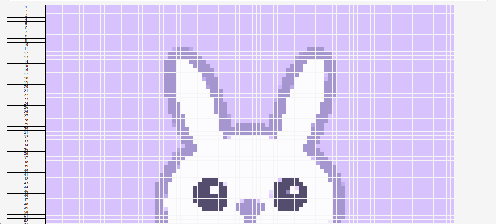

# image-to-knit-or-crochet-pattern-app also known as Bunny

Craft and Art Project

Creating an art's and crafts project. (Temporary naming for the project for now)

| Ideas: |
|--|
|[installs/get started](/document/install.md)|
|[user story](/documents/userstory.md)|



This project is a web application that converts images to crochet patterns. Users can upload an image, define the pixel size, and generate a pixelated version of the image along with a color grid and pattern details.

## Features

- Upload an image
- Define pixel size
- Generate a pixelated version of the image
- Display a color grid with color names
- Tooltip for each cell displaying color and position
- Sidebar list of colors with highlighted click and hover information

## Project Structure
```
image-to-knit-or-crochet-pattern-app/
│
├── .github/
│ └── workflows/
│ └── ci.yml
├── styles.css
├── images/
└── Bunny_Circle_Lavender.png
├── script.js
├── index.html
├── app.py
├── LICENSE
├── README.md
└── requirements.txt
```

## Usage

1. **Upload an Image:**

   - Click the "Upload Your Image" button to select an image file from your computer.
   - The image should be in a common format such as PNG, JPG, or JPEG.

2. **Define Pixel Size:**

   - Enter the desired pixel size in the "Define Your Pixel Size" input box.
   - Click the "Upload" button to generate the pixelated version of the image.

3. **View Results:**
   - The pixelated image will be displayed along with a color grid.
   - Hover over each color box to see the color name and position in a tooltip.
   - The sidebar will list all the colors used in the pattern. Click on a color to highlight it.

## Continuous Integration

This project uses GitHub Actions for Continuous Integration. The workflow is defined in `.github/workflows/ci.yml` and performs the following tasks:

- Checks out the repository
- Sets up Python
- Installs dependencies
- Runs tests to ensure the Flask app starts correctly

## License

This project is licensed under the MIT License. See the [LICENSE](LICENSE) file for details.

## Contributions

Contributions are welcome! Please fork the repository and use a feature branch. Pull requests are warmly welcome.

## Acknowledgements

- [Flask](https://flask.palletsprojects.com/) - The web framework used
- [Pillow](https://python-pillow.org/) - Python Imaging Library
- [ntc.js](https://chir.ag/projects/ntc/ntc.js) - Name that Color JavaScript library

For more information on installing packages using `pip`, refer to the [official guide](https://packaging.python.org/en/latest/tutorials/installing-packages/).

## Contact

Created by [Aimee](https://github.com/aimeelramirez) - feel free to contact me!
